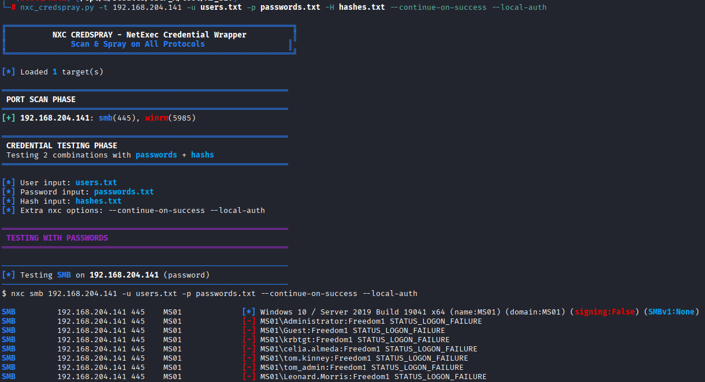

# NXC CredSpray

A wrapper for [NetExec (nxc)](https://github.com/Pennyw0rth/NetExec) that automatically scans targets for open ports and tests credentials on all discovered protocols.



## Features

- **Automatic Port Scanning**: Scans targets for protocol-specific ports before testing
- **Multi-Protocol Support**: Tests credentials on all open protocols in one run
- **Combined Credentials**: Use both passwords and hashes in a single run (passwords tested first, then hashes)
- **Native nxc Colors**: Preserves NetExec's color output for familiar visuals
- **Real-time Output**: See nxc output as it happens
- **Success Summary**: Collects and displays all successful authentications at the end

## Supported Protocols

| Protocol | Ports |
|----------|-------|
| SMB | 445 |
| WinRM | 5985, 5986 |
| RDP | 3389 |
| LDAP | 389, 636 |
| MSSQL | 1433 |

## Installation

Requires Python 3 and NetExec installed:

```bash
# Install NetExec
pipx install netexec

# Clone this repo
git clone https://github.com/michel-d96/nxc-cs.py.git
cd nxc_cs.py

# Make executable (optional)
chmod +x nxc_cs.py
```

## Usage

```
python3 nxc_cs.py -t <target> -u <user> [-p <password>] [-H <hash>] [nxc options]
```

### Required Arguments

| Argument | Description |
|----------|-------------|
| `-t, --target` | Target file (one per line) or single IP/hostname |
| `-u, --user` | Username file or single username |
| `-p, --password` | Password file or single password |
| `-H, --hash` | NTLM hash file or single hash (can be combined with `-p`) |

### Optional Arguments

| Argument | Description |
|----------|-------------|
| `--protocols` | Comma-separated list of protocols to test (default: all open) |
| `--skip-scan` | Skip port scan and test all protocols |
| `--timeout` | Port scan timeout in seconds (default: 2.0) |

All other arguments are passed directly to nxc (e.g., `--local-auth`, `--continue-on-success`).

## Examples

### Basic password spray
```bash
python3 nxc_cs.py -t targets.txt -u users.txt -p passwords.txt
```

### Single target with single credential
```bash
python3 nxc_cs.py -t 192.168.1.10 -u administrator -p Password123
```

### Hash-based authentication
```bash
python3 nxc_cs.py -t targets.txt -u users.txt -H hashes.txt
```

### Combined passwords AND hashes
```bash
# Tests all passwords first, then all hashes
python3 nxc_cs.py -t targets.txt -u users.txt -p passwords.txt -H hashes.txt
```

### With local authentication
```bash
python3 nxc_cs.py -t targets.txt -u admin -p password --local-auth
```

### Test only specific protocols
```bash
python3 nxc_cs.py -t targets.txt -u users.txt -p passwords.txt --protocols smb,winrm
```

### Skip port scan (test all protocols)
```bash
python3 nxc_cs.py -t 192.168.1.10 -u admin -p pass --skip-scan
```

### Continue on success
```bash
python3 nxc_cs.py -t targets.txt -u users.txt -p passwords.txt --continue-on-success
```

## Output

The tool provides:

1. **Port Scan Results**: Shows which protocols are open on each target
2. **Real-time nxc Output**: See authentication attempts as they happen
3. **Summary**: All successful authentications grouped by credential type

Example output:
```
╔══════════════════════════════════════════════════════════════╗
║          NXC CREDSPRAY - NetExec Credential Wrapper          ║
║              Scan & Spray on All Protocols                   ║
╚══════════════════════════════════════════════════════════════╝

[*] Loaded 2 target(s)

══════════════════════════════════════════════════════════════
 PORT SCAN PHASE
══════════════════════════════════════════════════════════════
[+] 192.168.1.10: smb(445), winrm(5985)
[+] 192.168.1.11: smb(445), ldap(389,636)

══════════════════════════════════════════════════════════════
 CREDENTIAL TESTING PHASE
══════════════════════════════════════════════════════════════
...

══════════════════════════════════════════════════════════════
 SUMMARY - SUCCESSFUL AUTHENTICATIONS
══════════════════════════════════════════════════════════════

Password Authentication:
  [+] SMB 192.168.1.10 445 DC01 [+] DOMAIN\admin:Password123 (Pwn3d!)

[+] Total successful: 1
[!] PWNED ACCOUNTS: 1
```